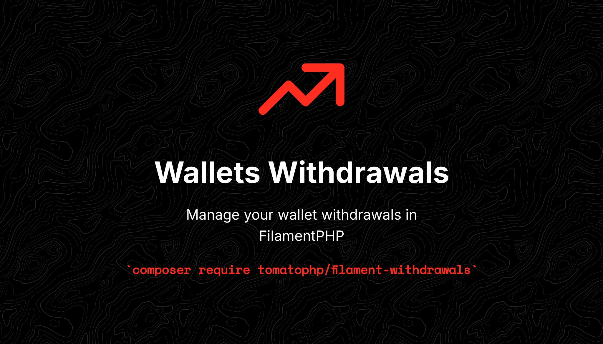

# 💳 Filament Withdrawals

<figure><figcaption></figcaption></figure>

Manage your withdrawals in Filament

## Support

you can join our discord server to get support [TomatoPHP](https://discord.gg/vKV9U7gD3c)

## Changelog

Please see [CHANGELOG](CHANGELOG.md) for more information on what has changed recently.

## Security

Please see [SECURITY](SECURITY.md) for more information about security.

## Credits

- [Abdelmjid](https://wa.me/201091523908)

## License

The MIT License (MIT). Please see [License File](LICENSE.md) for more information.