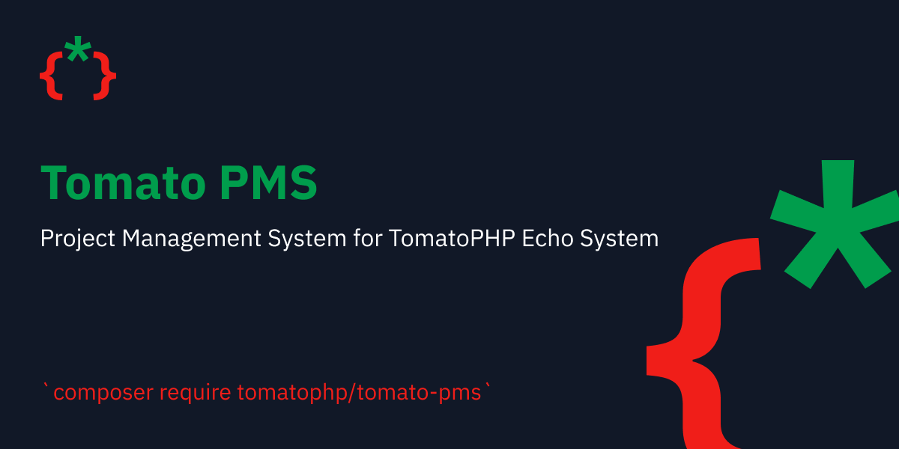

# 🛍 Tomato Ecommerce

<figure><figcaption></figcaption></figure>

<figure><figcaption></figcaption></figure>

before starting to install tomato-ecommerce make sure that you have this package installed and configured

* [Tomato Admin](broken-reference)
* [Tomato Roles](../tomato-roles/)
* [Tomato Settings](../tomato-settings/)
* [Tomato Translations](../tomato-translations.md)
* [Tomato Menus](../tomato-menus/)
* [Tomato Category](../tomato-category/)
* [Tomato Notifications](../tomato-notifications/)
* [Tomato Forms](../tomato-forms/)
* [Tomato CRM](../tomato-crm/)
* [Tomato CMS](../tomato-cms/)
* [Tomato Wallet](../tomato-wallet/)
* [Tomato Products](../tomato-products/)
* [Tomato Orders](../tomato-orders/)
* [Tomato Coupons](../tomato-coupons/)
* [Tomato Support](../tomato-support/)
* [Tomato Themes](../tomato-themes/)

### Installation

```
composer require tomatophp/tomato-ecommerce
```

after installing your package please run this command

```
php artisan tomato-ecommerce:install
```

### Changelog

Please see [CHANGELOG](https://github.com/tomatophp/tomato-ecommerce/blob/master/CHANGELOG.md) for more information on what has changed recently.

### Security

Please see [SECURITY](https://github.com/tomatophp/tomato-ecommerce/blob/master/SECURITY.md) for more information about security.

### Credits

* [Fady Mondy](mailto:info@3x1.io)

### License

The MIT License (MIT). Please see [License File](https://github.com/tomatophp/tomato-ecommerce/blob/master/LICENSE.md) for more information.
