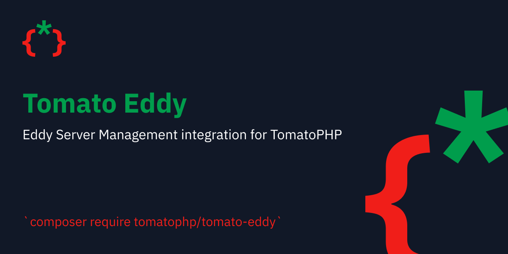

# 📠 Tomato Eddy

<figure><figcaption></figcaption></figure>

before installation, you can check the main repo of [Eddy](https://github.com/protonemedia/eddy-server-management), we do a lot of updates and make Eddy work on the version of Ubuntu and Hetzner API, with fine UI by Tomato Admin and it's components.

### Installation

```
composer require tomatophp/tomato-eddy
```

after installing your package please run this command

```
php artisan tomato-eddy:install
```

### Changelog

Please see [CHANGELOG](https://github.com/tomatophp/tomato-eddy/blob/master/CHANGELOG.md) for more information on what has changed recently.

### Security

Please see [SECURITY](https://github.com/tomatophp/tomato-eddy/blob/master/SECURITY.md) for more security information.

### Credits

* [Fady Mondy](https://3x1.io)

### License

The MIT License (MIT). Please see [License File](https://github.com/tomatophp/tomato-eddy/blob/master/LICENSE.md) for more information.
