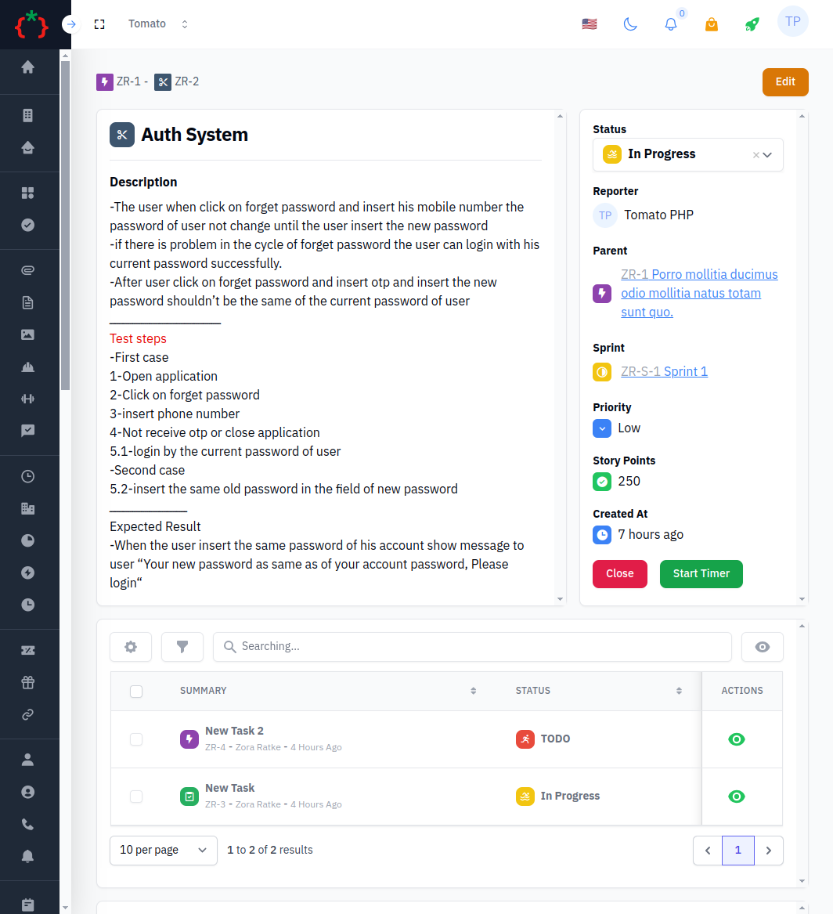

# ✅ Tomato Tasks

###

<figure><figcaption></figcaption></figure>

<figure><figcaption></figcaption></figure>

### Installation

```
composer require tomatophp/tomato-tasks
```

after installing your package please run this command

```
php artisan tomato-tasks:install
```

### Publish Assets

you can publish a config file by using this command

```
php artisan vendor:publish --tag="tomato-tasks-config"
```

you can publish view files by using this command

```
php artisan vendor:publish --tag="tomato-tasks-views"
```

you can publish language files by using this command

```
php artisan vendor:publish --tag="tomato-tasks-lang"
```

you can publish migration files by using this command

```
php artisan vendor:publish --tag="tomato-tasks-migrations"
```

### Changelog

Please see [CHANGELOG](https://github.com/tomatophp/tomato-tasks/blob/master/CHANGELOG.md) for more information on what has changed recently.

### Security

Please see [SECURITY](https://github.com/tomatophp/tomato-tasks/blob/master/SECURITY.md) for more security information.

### Credits

* [Fady Mondy](https://3x1.io)

### License

The MIT License (MIT). Please see [License File](https://github.com/tomatophp/tomato-tasks/blob/master/LICENSE.md) for more information.
