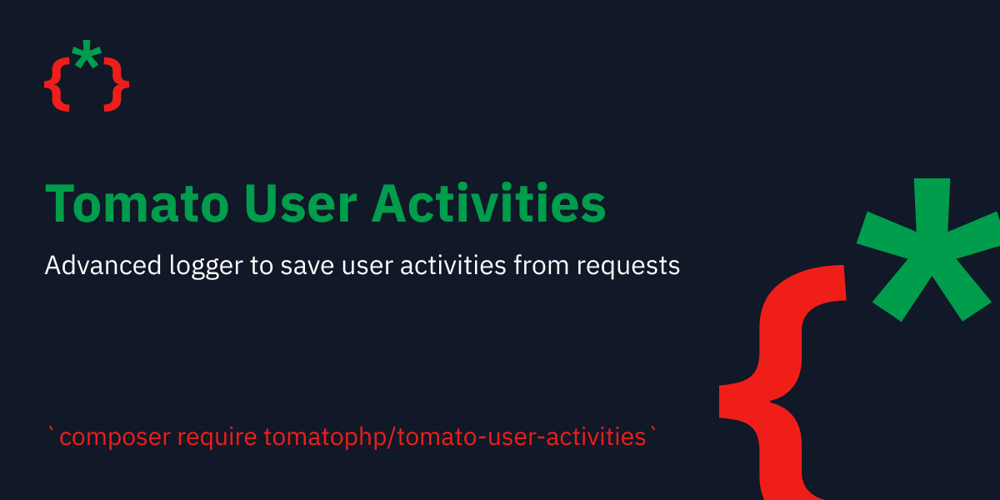

# 👨💻 Tomato User Activities


<figure><figcaption></figcaption></figure>

Advanced logger is a Laravel package used to automatically log every request made to your Laravel application. Each request is also identified by a hash, which can be used in the standard log to identify the request.

This package has been inspired by the package [https://github.com/andersao/laravel-request-logger](https://github.com/andersao/laravel-request-logger) from Anderson Andrade.

### Installation

```
composer require tomatophp/tomato-user-activities
```

### Changelog

Please see [CHANGELOG](https://github.com/tomatophp/tomato-user-activities/blob/master/CHANGELOG.md) for more information on what has changed recently.

### Credits

* [Fady Mondy](https://github.com/3x1io)

### License

The MIT License (MIT). Please see [License File](https://github.com/tomatophp/tomato-user-activities/blob/master/LICENSE.md) for more information.
