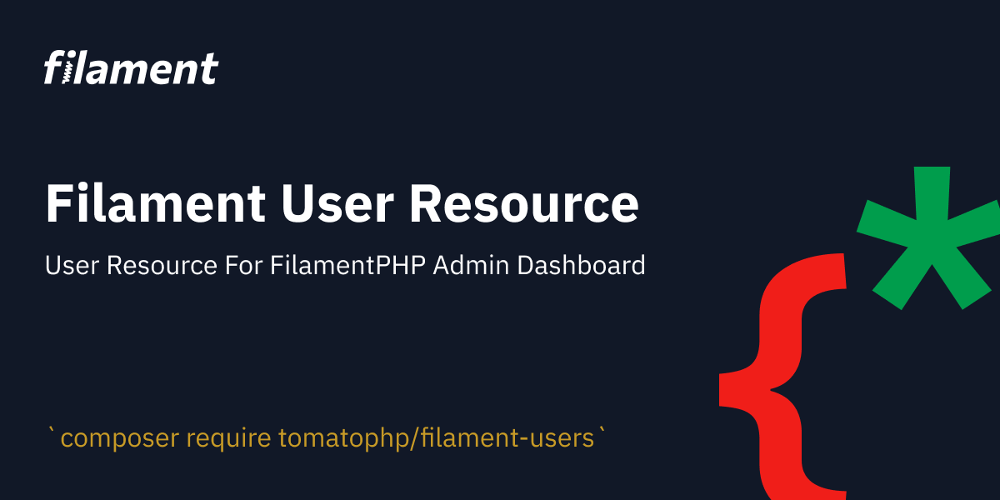

# 🔁 Inputs Repeater

<figure><figcaption></figcaption></figure>

if you have a JSON object and you want to fill it with data with a selected type of input? it can be easy to use Repeater Components.

this component has 2 types, repeater/schema, the repeater builds an array of JSON but schema builds just 1 JSON Object

```html
:options="['label']"
```

this attribute must have a field of your JSON object and you can access these fields by using v-model  like this&#x20;

```html
repeater.main[key].label
```

where the label is the name of the field, and here is an example for your repeater.

```html
<x-tomato-admin-repeater 
    :options="['label']" 
    type="repeater" 
    id="site_menu" 
    name="site_menu" 
    label="Site Menu" 
    required
>
    <x-splade-input 
        class="my-2" 
        v-model="repeater.main[key].label" 
        type="text" 
        placeholder="label"   
        required  
    />
</x-tomato-admin-repeater>
```
